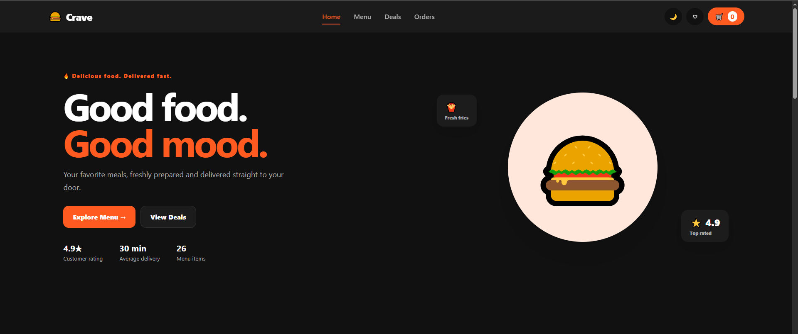

[README.md](https://github.com/user-attachments/files/32423472/README.md)
# 🍔 Crave — Food Ordering Web App

<p align="center">
  <strong>A modern, responsive food-ordering experience built with HTML, CSS and JavaScript.</strong>
</p>

<p align="center">
  <a href="https://cravefoodordering.netlify.app/">Live Demo</a>
  ·
  <a href="https://github.com/Him-codes/crave-food-ordering">Source Code</a>
</p>

---

## 📸 Preview



## ✨ Overview

**Crave** is a portfolio-focused food ordering web application designed to feel like a real modern delivery platform.

Users can browse meals, search and filter the menu, view product details, manage a shopping cart, save favorites, apply promotional discounts, complete a simulated checkout, and view previous orders.

The project focuses on responsive design, reusable front-end logic, polished UI, and a complete end-to-end ordering experience.

## 🚀 Features

- 🏠 Responsive landing page
- 🍔 Data-driven food menu
- 🔎 Search and category filtering
- 📋 Product detail pages
- 🛒 Shopping cart with quantity controls
- ❤️ Favorites system
- 🎟️ Promo code support
- 🚚 Free-delivery progress indicator
- 🔥 Deals and meal offers
- 💳 Simulated checkout flow
- 📦 Order confirmation and order history
- 🔄 Reorder functionality
- 🌙 Dark mode
- 📱 Responsive mobile navigation
- 🔔 Toast notifications
- ⭐ Product ratings and review counts
- 💾 Local storage for cart, favorites, theme, and orders
- ♿ Keyboard/focus accessibility considerations

## 🛠️ Tech Stack

| Technology | Purpose |
|---|---|
| **HTML5** | Semantic page structure |
| **CSS3** | Responsive layouts, styling, animations and themes |
| **JavaScript** | UI interactions, product data, cart, favorites, checkout and local storage |
| **Git & GitHub** | Version control and source management |
| **Netlify** | Deployment and hosting |

## 📂 Project Structure

```text
crave-food-ordering/
├── assets/
│   ├── icons/
│   └── images/
├── css/
│   └── style.css
├── js/
│   ├── app.js
│   └── products.js
├── account.html
├── cart.html
├── checkout.html
├── deals.html
├── favorites.html
├── index.html
├── menu.html
├── orders.html
├── product.html
├── favicon.svg
└── README.md
```

## 🎯 Project Goals

Crave was built to demonstrate practical front-end development skills through a realistic multi-page product.

Key goals included:

- Creating a polished and consistent visual system
- Building reusable JavaScript functionality
- Managing client-side application state
- Making the experience responsive across screen sizes
- Designing a complete shopping flow rather than a static landing page
- Practicing deployment and version control with GitHub and Netlify

## 🧠 What I Learned

Working on Crave strengthened my experience with:

- Multi-page website architecture
- DOM manipulation and event handling
- JavaScript data structures
- Local storage
- Client-side state management
- Responsive web design
- Reusable UI patterns
- Form and checkout flows
- Debugging and cross-page consistency
- Accessibility and keyboard focus states
- GitHub workflows
- Netlify deployment

## 🔮 Future Improvements

Possible future versions could include:

- Real user authentication
- Backend and database integration
- Real payment processing
- Live inventory management
- Restaurant/admin dashboard
- Real-time order tracking
- Customer accounts
- Order notifications
- Product reviews
- Backend API integration

## 👨‍💻 Developer

**Somtochukwu Ezeimo**

Computer Science Student · Web Developer

## 🔗 Links

- **Live Demo:** https://cravefoodordering.netlify.app/
- **GitHub:** https://github.com/Him-codes/crave-food-ordering

---

> Built as a portfolio project to demonstrate front-end development, responsive design, JavaScript functionality, and deployment workflows.
